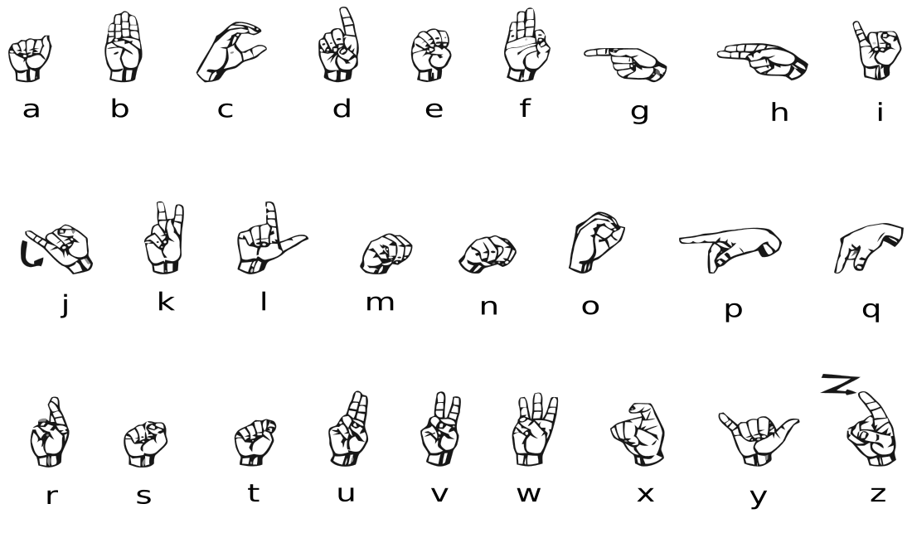
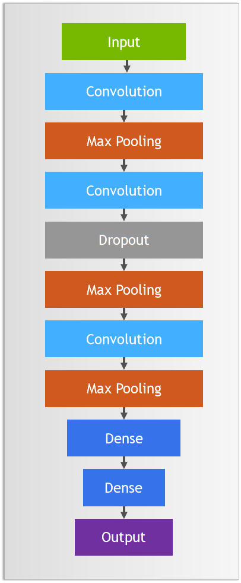

# CNN Image Classification Project
## Project Overview
This project implements a Convolutional Neural Network (CNN) for image classification using PyTorch. The model architecture consists of three convolutional layers followed by fully connected layers, designed to classify images into 24 different categories.

**Dataset**: The ASL MNIST dataset contains 27,455 training and 7,172 test images of hand signs representing digits. Each image is 28x28 pixels grayscale. The dataset only includes 24 classes of alphabets as J and Z require movement of the fingers and hence cannot be represented by an image.

    

## Model Architecture

The CNN architecture consists of:

- 3 Convolutional layers with batch normalization and ReLU activation
- Max pooling layers after each convolution
- Dropout for regularization
- 2 Fully connected layers
- Output layer with 24 classes (ASL letters)

    

## Requirements

Python 3.x
PyTorch
Intel Extension for PyTorch (IPEX) if using Intel GPU
NumPy
Jupyter Notebook

## License

This project is licensed under the GNU General Public License, Version 3 - see the [LICENSE.md](../LICENSE.md) file for details.

## Acknowledgements
- This Project was done based on instructions and examples provided by NVIDIA Deep Learning Insitute

    

      

