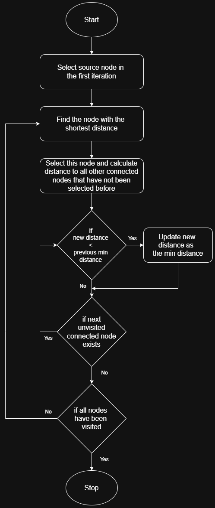
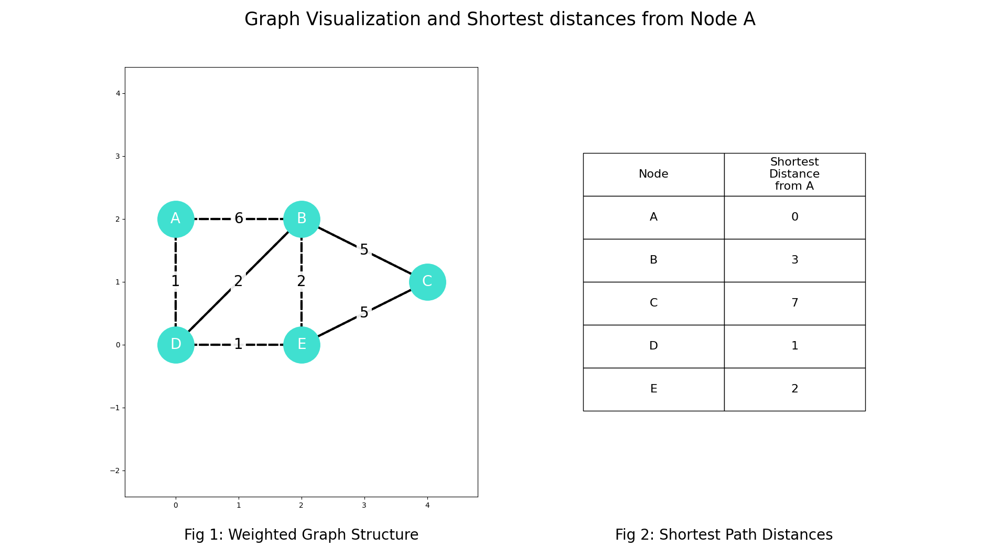

# Project Name: Dijkstra's Algorithm for finding the shortest distance in a weighted graph

 The goal of this project is to find the shortest distance between two nodes, A and C, in a weighted graph

### Acknowledgement: Robin Andrews, Compucademy, Foundations of Algorithmic Thinking with Python

## Description

The program implements a graph structure using dictionaries and visualizes the structure using Matplotlib.
There is a function that can calculate the shortest distances for any graph structure for any source node.
Finally, the graph structure and a table containing the shortest distances are displayed as output.

### Algorithm

The following flow chart can analyze the Dijkstra's Algorithm:

    

### Program Structure:

- Dijkstras1.py (main file)
- - Section to develop the graph structure and visualize it
- - Function for Dijkstra's Algorithm on any graph structure
- - Section to create the table of shortest distances 

## Output:

    

## License

This project is licensed under the GNU General Public License, Version 3 - see the [LICENSE.md](../../LICENSE.md) file for details.

## Contact

- Author: Ujval Madhu
- Email: ujvalmadhu003@gmail.com
